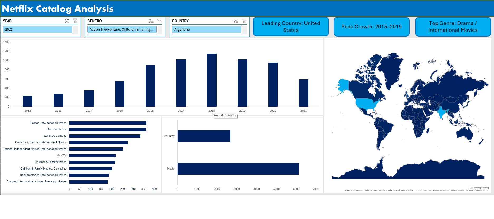

# 🎬 Netflix Catalog Analysis - Interactive Excel Dashboard

## 📌 Descripción del Proyecto
Este proyecto es un análisis exploratorio y visualización del catálogo histórico de Netflix. El objetivo fue transformar un conjunto de datos sin procesar en un panel interactivo para extraer *insights* de negocio y entender las estrategias de contenido de la plataforma. Este proyecto demuestra habilidades de procesamiento de datos, estructuración y visualización.

## 🛠️ Herramientas y Habilidades Aplicadas
* **Microsoft Excel:** Limpieza de datos, estandarización y resolución de errores estructurales en celdas.
* **Modelado de Datos:** Uso avanzado de Tablas Dinámicas con configuración de múltiples filtros simultáneos y reglas de "Top 10" para optimización visual.
* **Data Visualization:** Diseño de un Dashboard corporativo interactivo con segmentadores cruzados y una paleta de colores limpia, enfocada en la legibilidad ejecutiva.

## 🎯 Preguntas de Negocio Respondidas
A través de este tablero interactivo, el usuario final puede responder dinámicamente las siguientes preguntas:
1. ¿Cuál es el formato predominante en la plataforma (TV Shows vs. Movies) a nivel histórico y segmentado por año?
2. ¿Cómo ha evolucionado el volumen de contenido agregado a lo largo del tiempo?
3. ¿Cuáles son los 10 países líderes absolutos en la producción de contenido global?
4. ¿Cuáles son los géneros que representan el mayor volumen de inversión/agregación para la plataforma?

## 📊 Vista del Dashboard interactivo

*(El tablero permite filtrar todos los gráficos y KPIs simultáneamente por Año y Tipo de Contenido).*

## 🚀 Principales Insights Descubiertos
* **Crecimiento Explosivo:** La agregación de volumen de producción tuvo un punto de inflexión y crecimiento exponencial a partir de 2015.
* **Dominio del Formato:** A pesar del auge cultural de las series, las películas continúan dominando el catálogo histórico por un amplio margen.
* **Concentración Geográfica:** Estados Unidos es el productor indiscutible, marcando la pauta del contenido global, seguido por India.
